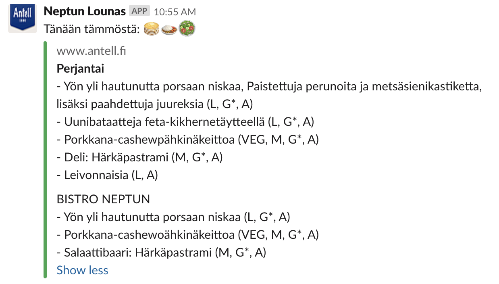

# Neptun Lounas for Slack

[](http://anttiviljami.mit-license.org)

Scrapes and passes the lunch menu to Slack



## Development

Install deps:

```
npm install
```

To test the function:

```
npm run invoke
```

## Deploy

Make sure `AWS_SECRET_ACCESS_KEY` and `AWS_ACCESS_KEY_ID` are set. (See `.env.sample`)

```
npm run deploy
```
